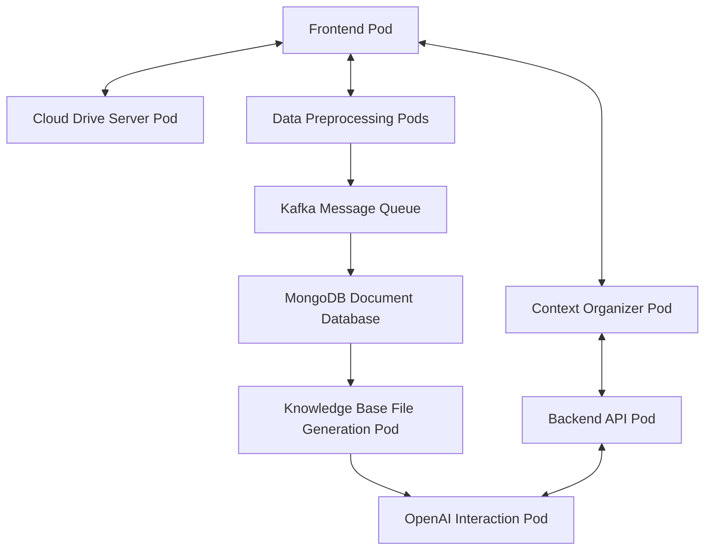

# IntelliDoc

> Intelligent Document Automation and Knowledge Enhancement System

## 1. System Overview

This system is an AI-assisted document editor based on Kubernetes, integrating multiple components such as a frontend interface, backend processing, data preprocessing, message queue, data storage, knowledge base generation, and AI interaction. The system is designed with scalability, high availability, and efficient data processing in mind, aiming to provide a smooth and intelligent document editing experience. It leverages LLM to improve user development efficiency and fully collects and utilizes various data generated during user development to enhance the accuracy of the dedicated model and enrich its knowledge base.

## 2. System Architecture Diagram

## 3. Component Details

### 3.1 Frontend Pod

- **Function**: Provides the user interface, including source document input, AI dialogue, and display of modified documents.
- **Implementation**:
  - Built as a single-page application (SPA) using React.js.
  - Implement WebSocket connection to support real-time updates.
  - Integrate a Markdown editor and real-time preview functionality.
  - Implement lightweight frontend data preprocessing logic.
- **Design Advantages**:
  - Responsive design adapts to different devices.
  - Supports real-time collaboration and instant feedback.
  - Frontend preprocessing reduces backend load and improves response speed.

### 3.2 Backend API Pod

- **Function**: Handles frontend requests and coordinates the work of various components.
- **Implementation**:
  - Constructed as a RESTful API using Node.js and Express.js.
  - Implements a WebSocket server for real-time communication.
  - Utilizes Redis for session management and caching.
  - Includes request validation and error handling middleware.
- **Design Advantages**:
  - Supports high concurrency request processing.
  - Stateless design facilitates horizontal scaling.
  - Caching mechanism improves response speed and reduces database pressure.

### 3.3 Data Preprocessing Pods (×N)

- **Function**: Cleanses, formats, and performs preliminary analysis on user input documents and dialogue content.
- **Implementation**:
  - Data cleansing and preprocessing logic implemented in Python.
  - Deployed with Kubernetes Deployment for multiple instances.
  - Implements task queue to ensure load balancing.
  - Uses Celery for asynchronous task processing.
- **Design Advantages**:
  - Supports parallel processing, increasing system throughput.
  - Dynamic scaling based on load, optimizing resource utilization.
  - Flexible preprocessing logic to adapt to different types of documents and dialogues.

### 3.4 Context Organizer Pod

- **Function**: Formats content input from the Frontend Pod and Backend API Pod for display and external interaction.
- **Implementation**:
  - Data processing implemented in Python.
  - Service used for internal service communication.
- **Design Advantages**:
  - Supports parallel processing, increasing system throughput.
  - Flexible preprocessing logic to adapt to different types of documents and dialogues.

### 3.5 Kafka Message Queue

- **Function**: Temporarily stores and transmits preprocessed data.
- **Implementation**:
  - Configures multiple topics to handle different types of data streams.
  - Implements high availability configuration for producers and consumers.
  - Configures appropriate data retention policies.
- **Design Advantages**:
  - Decouples data production and consumption, enhancing system flexibility.
  - Supports high-throughput data transmission.
  - Provides data persistence, preventing data loss.

### 3.6 MongoDB Document Database

- **Function**: Persistent storage for documents and related data.
- **Implementation**:
  - Uses MongoDB replica set to ensure high availability.
  - Implements data sharding to improve storage and query performance.
  - Designs optimized indexing strategies to accelerate data retrieval.
  - Implements data version control and historical record tracking.
- **Design Advantages**:
  - Flexible document storage model adapts to complex data structures.
  - Supports large-scale data storage and fast querying.
  - Provides powerful aggregation capabilities for data analysis.

### 3.7 Knowledge Base File Generation Pod

- **Function**: Generates structured knowledge base files based on stored data.
- **Implementation**:
  - Uses natural language processing technology to extract key information.
  - Implements knowledge graph construction algorithms.
  - Uses template engines to generate structured documents.
- **Design Advantages**:
  - Automates knowledge extraction and organization, enhancing AI-assisted efficiency.
  - Supports incremental updates, reducing repetitive processing.
  - Generated knowledge bases can be used for various AI tasks.

### 3.8 OpenAI Interaction Pod

- **Function**: Interacts with the OpenAI API to handle AI-assisted requests.
- **Implementation**:
  - Secure management of API keys (using Kubernetes Secrets).
  - Uses asynchronous I/O to handle concurrent API requests.
  - Implements intelligent request throttling and retry mechanisms.
  - Integrates local language models as fallback options.
- **Design Advantages**:
  - Efficiently handles a large number of concurrent AI requests.
  - Intelligently manages API usage, optimizing cost and performance.
  - Provides a failover mechanism to ensure service availability.

## 4. Overall System Design Advantages

1. **High Scalability**:

   - Each component is designed for independent scaling.
   - Automated horizontal scaling using Kubernetes.
   - Kafka and MongoDB support data-level scaling.
2. **Robust Real-time Processing Capabilities**:

   - Frontend and backend WebSocket connections support real-time updates.
   - Kafka provides high-throughput real-time data stream processing.
   - Parallel design of Data Preprocessing Pods supports rapid data processing.
3. **Flexible Data Processing Workflow**:

   - A complete data flow from frontend to AI interaction supports complex processing logic.
   - Easily add or modify processing steps to meet different business needs.
4. **High Availability and Fault Tolerance**:

   - Key components are designed for multi-instance deployment.
   - Message queues and database persistence mechanisms prevent data loss.
   - Multi-level error handling and recovery mechanisms implemented.
5. **Optimized Performance**:

   - Frontend preprocessing reduces backend load.
   - Caching mechanisms improve response speed.
   - Parallelized data preprocessing increases overall processing efficiency.
6. **Security**:

   - Ingress layer implements unified access control and SSL termination.
   - Sensitive information (e.g., API keys) managed using Kubernetes Secrets.
   - Fine-grained access control and data isolation implemented.
7. **Intelligence**:

   - Integrated advanced NLP technologies and knowledge graphs.
   - Seamless integration with OpenAI API provides powerful AI assistance.
   - Supports local language models as fallback options, enhancing system autonomy.
8. **Cost Efficiency**:

   - Dynamic resource allocation ensures efficient resource utilization.
   - Intelligent API call management optimizes the use of external services.
   - Adjust the scale of each component based on actual needs to avoid resource waste.
9. **Developer and Maintenance Friendly**:

   - Modular design facilitates team collaboration and independent development.
   - Containerization simplifies deployment and environment management.
   - Comprehensive monitoring and logging systems ease issue diagnosis and performance optimization.
10. **User Experience Optimization**:

    - Real-time editing and preview provide a smooth operation experience.
    - AI assistance improves the efficiency and quality of document editing.
    - Responsive design ensures a good experience across various devices.
