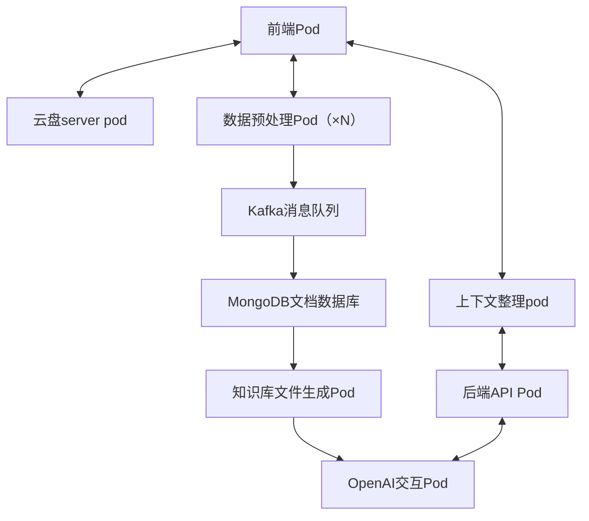

# AI辅助项目开发工具 - 系统架构文档

## 1. 系统概述

本系统是一个基于 Kubernetes 的 AI 辅助文档编辑器，集成了前端界面、后端处理、数据预处理、消息队列、数据存储、知识库生成和 AI 交互等多个组件。系统设计秉承高可扩展性、高可用性和高效数据处理的原则，旨在提供流畅、智能的文档编辑体验，同时通过结合LLM提高用户开发效率，并充分收集和利用用户开发过程中产生的各种数据，用于提升专属模型的准确性以及完善其知识库。

## 2. 系统架构图

## 3. 组件详细说明

### 3.1 前端Pod

- **功能**：提供用户界面，包括源文档输入、AI对话和修改后文档显示
- **实现方案**：
  - 使用 React.js 构建单页应用（SPA）
  - 实现 WebSocket 连接，支持实时更新
  - 集成 Markdown 编辑器和实时预览功能
  - 实现轻量级的前端数据预处理逻辑
- **设计优点**：
  - 提供响应式设计，适应不同设备
  - 支持实时协作和即时反馈
  - 通过前端预处理减轻后端负载，提高响应速度

### 3.2 后端API Pod

- **功能**：处理前端请求，协调各个组件的工作
- **实现方案**：
  - 使用 Node.js 和 Express.js 构建 RESTful API
  - 实现 WebSocket 服务器，处理实时通信
  - 使用 Redis 进行会话管理和缓存
  - 实现请求验证和错误处理中间件
- **设计优点**：
  - 支持高并发请求处理
  - 实现无状态设计，便于水平扩展
  - 通过缓存机制提高响应速度，减轻数据库压力

### 3.3 数据预处理Pod（×N）

- **功能**：对用户输入的文档和对话内容进行清洗、格式化和初步分析
- **实现方案**：
  - 使用 Python 实现数据清洗和预处理逻辑
  - 利用 Kubernetes Deployment 实现多实例部署
  - 实现任务队列，确保负载均衡
  - 使用 Celery 进行异步任务处理
- **设计优点**：
  - 支持并行处理，提高系统吞吐量
  - 可根据负载动态扩缩容，优化资源利用
  - 灵活的预处理逻辑，适应不同类型的文档和对话
 
### 3.4 上下文整理Pod

- **功能**：对前端pod和后端API pod输入的内容进行格式化，便于显示以及对外交互
- **实现方案**：
  - 使用 Python 实现数据处理
  - 使用 service 实现内部服务
- **设计优点**：
  - 支持并行处理，提高系统吞吐量
  - 灵活的预处理逻辑，适应不同类型的文档和对话

### 3.5 Kafka消息队列

- **功能**：暂存和传输预处理后的数据
- **实现方案**：
  - 配置多个主题，分别处理不同类型的数据流
  - 实现生产者和消费者的高可用性配置
  - 配置适当的数据保留策略
- **设计优点**：
  - 解耦数据生产和消费，提高系统弹性
  - 支持高吞吐量的数据传输
  - 提供数据持久化，防止数据丢失

### 3.6 MongoDB文档数据库

- **功能**：持久化存储文档和相关数据
- **实现方案**：
  - 使用 MongoDB 副本集确保高可用性
  - 实现数据分片，提高存储和查询性能
  - 设计优化的索引策略，加速数据检索
  - 实现数据版本控制和历史记录追踪
- **设计优点**：
  - 灵活的文档存储模型，适应复杂的数据结构
  - 支持大规模数据存储和快速查询
  - 提供强大的聚合功能，便于数据分析

### 3.7 知识库文件生成Pod

- **功能**：基于存储的数据生成结构化的知识库文件
- **实现方案**：
  - 使用自然语言处理技术提取关键信息
  - 实现知识图谱构建算法
  - 使用模板引擎生成结构化文档
  - （这个纯瞎编的，不想实现问题也不大）
- **设计优点**：
  - 自动化知识提取和组织，提高AI辅助效率
  - 支持增量更新，减少重复处理
  - 生成的知识库可用于多种AI任务

### 3.8 OpenAI交互Pod

- **功能**：与OpenAI API交互，处理AI辅助请求
- **实现方案**：
  - 实现API密钥的安全管理（使用Kubernetes Secrets）
  - 使用异步IO处理并发API请求
  - 实现智能的请求限流和重试机制
  - 集成本地语言模型作为备选方案
- **设计优点**：
  - 高效处理大量并发的AI请求
  - 智能管理API使用，优化成本和性能
  - 提供故障转移机制，确保服务可用性

## 4. 系统整体设计优点

1. **高度可扩展性**：
   - 每个组件都设计为可独立扩展
   - 使用Kubernetes实现自动化的水平扩展
   - Kafka和MongoDB支持数据层面的扩展

2. **强大的实时处理能力**：
   - 前端和后端的WebSocket连接支持实时更新
   - Kafka提供高吞吐量的实时数据流处理
   - 数据预处理Pod的并行设计支持快速数据处理

3. **灵活的数据处理流程**：
   - 从前端到AI交互的完整数据流支持复杂的处理逻辑
   - 可以轻松添加或修改处理步骤，适应不同的业务需求

4. **高可用性和容错性**：
   - 关键组件都设计为多实例部署
   - 使用消息队列和数据库的持久化机制防止数据丢失
   - 实现了多层次的错误处理和恢复机制

5. **优化的性能**：
   - 前端预处理减轻了后端负载
   - 使用缓存机制提高响应速度
   - 数据预处理的并行化提高了整体处理效率

6. **安全性**：
   - Ingress层实现了统一的访问控制和SSL终止
   - 敏感信息（如API密钥）使用Kubernetes Secrets管理
   - 实现了细粒度的权限控制和数据隔离

7. **智能化**：
   - 集成了先进的NLP技术和知识图谱
   - 无缝集成OpenAI API，提供强大的AI辅助能力
   - 支持本地语言模型作为备选，增强系统的自主性

8. **成本效益**：
   - 资源的动态分配确保了高效的资源利用
   - 智能的API调用管理优化了外部服务的使用成本
   - 可根据实际需求调整各组件的规模，避免资源浪费

9. **开发和维护友好**：
   - 模块化设计便于团队协作和独立开发
   - 使用容器化技术简化了部署和环境管理
   - 完善的监控和日志系统便于问题诊断和性能优化

10. **用户体验优化**：
    - 实时编辑和预览提供了流畅的操作体验
    - AI辅助功能提高了文档编辑的效率和质量
    - 响应式设计确保了在各种设备上的良好体验
